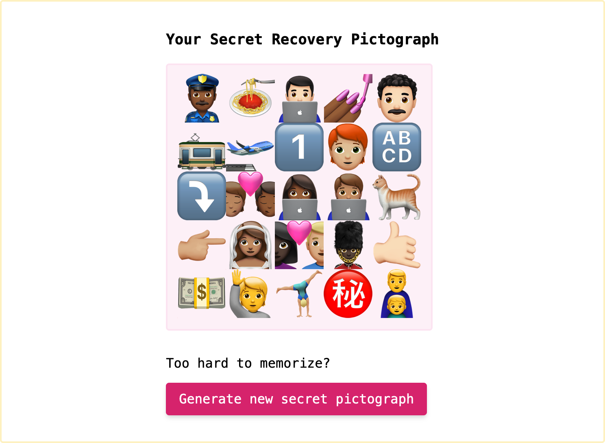

# Recovery Secret UX

UX experiment with generating secret recovery phrases.




> **Warning** I am not a security expert and this is not security advice. This demo has not been reviewed by a security expert and is not intended to be used as an actual secrets generator.

## Quickstart

**Prerequisite: Dev server expects `curl` to exist**

Install dependencies:

```sh
yarn
```

Run the dev server:

```sh
yarn serve
```

This will open a tab in your default browser to [localhost:8080](http://localhost:8080/).
