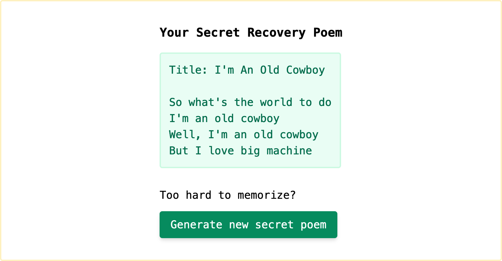

# Recovery Secret UX

UX experiment with generating secret recovery phrases.




> **Warning** I am not a security expert and this is not security advice. This demo has not been reviewed by a security expert and is not intended to be used as an actual secrets generator.

## Quickstart

**Prerequisite: Dev server expects `curl` to exist**

Install dependencies:

```sh
yarn
```

Run the dev server:

```sh
yarn serve
```

This will open a tab in your default browser to [localhost:8080](http://localhost:8080/).

### Generate emoji list

Emojis are pulled from [Unicode 13.0.0](https://www.unicode.org/versions/Unicode13.0.0/). If you're unable to see emojis in this version, you can downgrade `@unicode/unicode-13.0.0` to a compatible [node-unicode-data](https://github.com/node-unicode/node-unicode-data) version and update the version in `scripts/get-emojis.js` accordingly. You can upgrade to Unicode 14.0.0+ this way, too.
